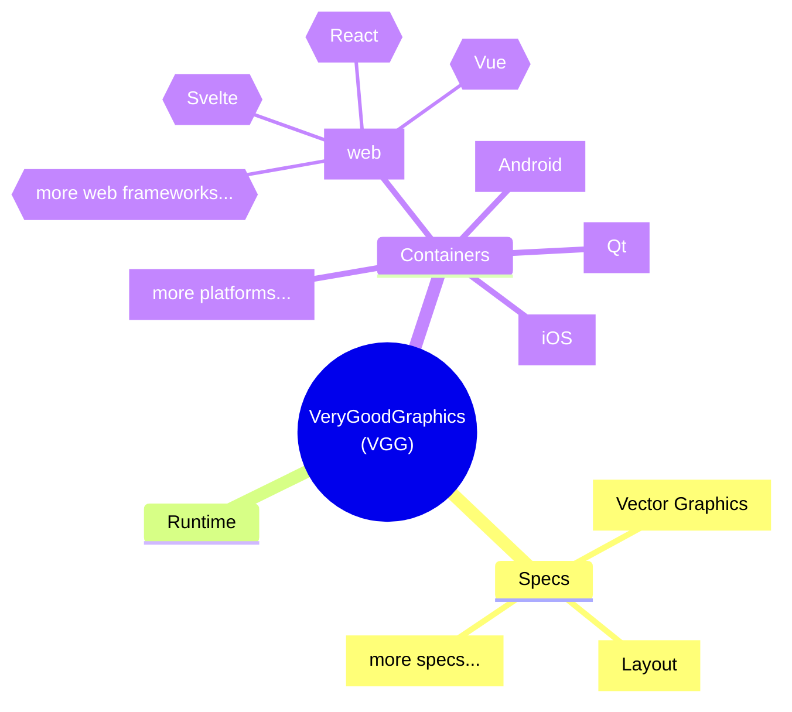

# VeryGoodGraphics (VGG)

VeryGoodGraphics (VGG) is the next-gen vector graphics and its toolkit for cross-platform UI development which is compatible with any framework and any platform.

It is currently composed of three main parts:
- [**VGG Specs**](https://docs.verygoodgraphics.com/specs/overview) is an open format for describing vector graphics and UI.
- [**VGG Runtime**](https://github.com/verygoodgraphics/vgg_runtime) is a C++ implementation of VGG Specs with cross-platform capabilities.
- [**VGG Containers**](https://docs.verygoodgraphics.com/containers/overview) is a set of thin-wrappers and adapters of VGG Runtime for various platforms and frameworks, that provide a high-level APIs for developer users.

The main goal of VGG is to let developers program directly on design drafts, like Figma, Sketch, Adobe or any other design formats, which is exactly the [_Design-as-Code_](https://docs.verygoodgraphics.com/workflow/overview) concept that VGG is advocating.

VGG aims to be an **embeddable** cross-platform UI framework compatible with existing design and development ecosystems. This ensures that design assets can be reused, and VGG users need not build new applications from scratch. Instead, they can seamlessly import and integrate VGG into existing projects, irrespective of the framework being used.

VGG is still at an early stage. Please join in VGG community to build it together!
